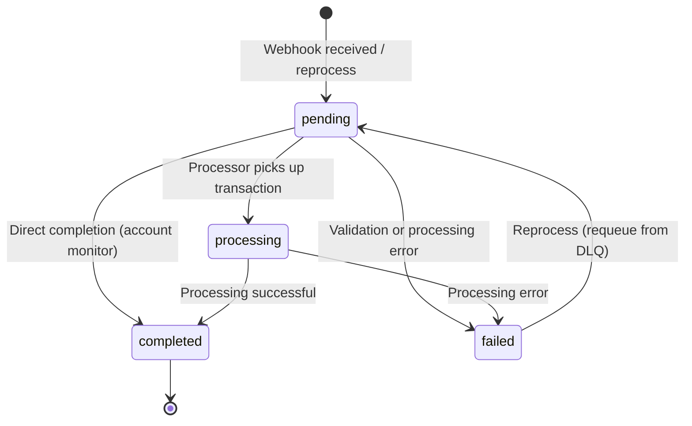

# Transaction State Machine

This document describes the transaction lifecycle and state transitions in Synapse Core.

## State Diagram



## States

### pending
**Initial state** — Transaction created and awaiting processing.

**Entry conditions:**
- Webhook received with valid payload
- Transaction requeued from DLQ (`failed → pending`)

**Exit transitions:**
- → `processing`: Processor picks up the transaction
- → `completed`: Direct completion (e.g., account monitor matches payment)
- → `failed`: Validation or processing error

**Database field:** `status = 'pending'`

---

### processing
**Intermediate state** — Transaction is actively being processed.

**Entry conditions:**
- Processor picks up a `pending` transaction

**Exit transitions:**
- → `completed`: Processing pipeline succeeds
- → `failed`: Processing pipeline fails

**Database field:** `status = 'processing'`

---

### completed
**Terminal state** — Transaction successfully processed and verified.

**Entry conditions:**
- Processing pipeline completes successfully
- Account monitor matches an incoming payment to a pending transaction

**Exit transitions:** None (terminal state)

**Database field:** `status = 'completed'`

---

### failed
**Error state** — Transaction failed and may be reprocessed.

**Entry conditions:**
- Processing error occurred at any stage

**Exit transitions:**
- → `pending`: Manual requeue via `requeue_dlq()` API

**Database field:** `status = 'failed'`

---

## Transition Validation

All status updates are guarded by `validate_status_transition(from, to) -> Result<(), AppError>` in `src/validation/state_machine.rs`.

Invalid transitions return `AppError::InvalidStatusTransition` (HTTP 400, code `ERR_TRANSACTION_005`).

### Valid Transitions Table

| From        | To          | Trigger                                 |
|-------------|-------------|-----------------------------------------|
| pending     | processing  | Processor picks up transaction          |
| pending     | completed   | Account monitor direct completion       |
| pending     | failed      | Validation or processing error          |
| processing  | completed   | Processing pipeline success             |
| processing  | failed      | Processing pipeline error               |
| failed      | pending     | Admin requeue from DLQ                  |

### Invalid Transitions (examples)

| From        | To          | Reason                                  |
|-------------|-------------|-----------------------------------------|
| completed   | pending     | Terminal state — cannot be reversed     |
| completed   | processing  | Terminal state — cannot be reversed     |
| completed   | failed      | Terminal state — cannot be reversed     |
| processing  | pending     | Must complete or fail, not revert       |
| failed      | processing  | Must go through pending first           |
| failed      | completed   | Must go through pending first           |

---

## Code References

### Validation Function
- `src/validation/state_machine.rs` — `validate_status_transition(from, to)`

### Status Update Sites
- `src/services/transaction_processor.rs` — `CompleteStage::execute()` (pending/processing → completed)
- `src/services/transaction_processor.rs` — `requeue_dlq()` (failed → pending)
- `src/services/account_monitor.rs` — `process_payment()` (pending → completed)

### Database Schema
- `migrations/20250216000000_init.sql` — `status VARCHAR(20) NOT NULL DEFAULT 'pending'`
- `migrations/20260220143500_transaction_dlq.sql` — DLQ table

---

## Error Handling

Invalid transitions return:

```json
{
  "error": "Invalid status transition: Cannot transition from 'completed' to 'pending'",
  "code": "ERR_TRANSACTION_005",
  "status": 400
}
```
